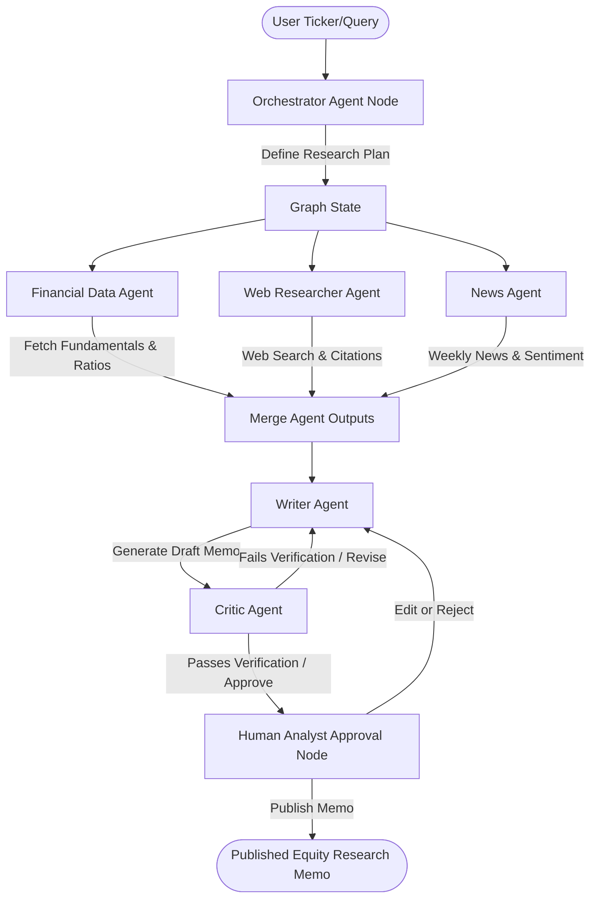

# AlphaAgents — Multi-Agent Equity Research Analyst
> **Automating institutional-grade investment research with a structured multi-agent LangGraph workflow and human-in-the-loop governance.**

---

## 1. Project Title & Tagline
**AlphaAgents**: A collaborative multi-agent system that analyzes equity tickers, performs deep web research, evaluates financial history, parses recent news sentiment, and drafts professionally structured investment memos with strict citation enforcement and human validation.

## 2. Demo
- **Demo Video (Loom)**: [Link to Week 1 / Milestone 1 Demo Video](https://loom.com/placeholder) *(To be updated after final run)*
- **Live Application URL**: [Live Streamlit App](https://alphaagents.streamlit.app) *(To be deployed during Week 4)*

## 3. Problem Statement
Institutional equity research is a highly labor-intensive process, taking analysts between 4 to 8 hours per stock to aggregate market filings, cross-check competitor ratios, analyze recent press developments, and synthesize structured investment recommendations. **AlphaAgents** automates this end-to-end collection, evaluation, and drafting workflow. By orchestrating six specialized agent nodes via LangGraph, the system generates comprehensive, citation-backed, 4-to-6-page equity research notes in under 5 minutes, maintaining strict factual consistency through automated critic review and human-in-the-loop validation.

## 4. Architecture Diagram
An overview of the LangGraph state machine flow:



Detailed C4 diagrams can be found in the [Architecture Documentation](file:///c:/Users/pavan%20kumar%20kota/OneDrive/Desktop/Internship%20-%202/docs/architecture.md).

## 5. Tech Stack

| Component | Choice | Why |
| :--- | :--- | :--- |
| **Agent Framework** | LangGraph | Explicit graph control over states, native human-in-the-loop interrupts, and loops. |
| **LLM Provider** | Google Gemini / OpenAI | Reliable JSON formatting, tool calling, and high context reasoning. |
| **Financial Data** | yfinance | Zero cost, no API keys, comprehensive stock fundamentals and ratios. |
| **Web Search** | Tavily Search API | Optimized search specifically designed for LLM agents, provides high-quality sources and text snippets. |
| **News Retrieval** | NewsAPI / RSS | Access to recent articles and market sentiment over the last 7 days. |
| **Front-End UI** | Streamlit | Rapid prototyping of highly interactive, data-rich user interfaces in pure Python. |
| **Testing** | pytest | Robust unit testing and integration testing for APIs and state transitions. |

## 6. Quickstart

### Prerequisites
- Python 3.11+
- Virtual environment tool (`venv` or `conda`)

### Install
1. Clone the repository and navigate to the directory:
   ```bash
   git clone https://github.com/pavankota59/Summer-Internship---2.git alphaagents
   cd alphaagents
   ```
2. Set up and activate a virtual environment:
   ```bash
   python -m venv .venv
   # Windows:
   .venv\Scripts\activate
   # Linux/macOS:
   source .venv/bin/activate
   ```
3. Install dependencies:
   ```bash
   pip install -r requirements.txt
   ```

### Run
To launch the interactive Streamlit UI locally:
```bash
streamlit run app.py
```

### Test
Execute the test suite using `pytest`:
```bash
pytest tests/
```

## 7. Data
We leverage a combination of primary financial APIs and search indices to fuel our agents:
* **yfinance**: Pulls daily/historical pricing, balance sheet, income statement, and valuation ratios.
* **Tavily**: Used by the Web Researcher Agent to query current industry dynamics and competitor positioning.
* **NewsAPI**: Queries recent headlines from reputable business publishers over the last 7 days.
For details, see the [Data Sources Documentation](file:///c:/Users/pavan%20kumar%20kota/OneDrive/Desktop/Internship%20-%202/docs/data.md).

## 8. ADRs
Our design decisions are structured as Architecture Decision Records:
* [ADR-001: LangGraph for Orchestration](file:///c:/Users/pavan%20kumar%20kota/OneDrive/Desktop/Internship%20-%202/docs/adr/adr_001.md)

## 9. Known Limitations
- **Data Latency**: yfinance pulls data that may be delayed relative to live market tickers.
- **NewsAPI Free Tier**: Limited to 100 requests per day, restricting bulk execution without keys.
- **Language Models**: Hallucination risks require rigorous validation loops (handled by Critic + HITL).

## 10. Roadmap
1. **Debate Node**: Introduce a Bull vs. Bear debate node before drafting the final memo.
2. **PDF Generation**: Add automated export of the published memo to professional PDF formats (e.g., ReportLab).
3. **Multi-Ticker Comparison**: Allow side-by-side comparative analysis reports.

## 11. License & Acknowledgements
- Distributed under the MIT License. See `LICENSE` for details.
- Special thanks to the Google DeepMind Advanced Agentic Coding team.
